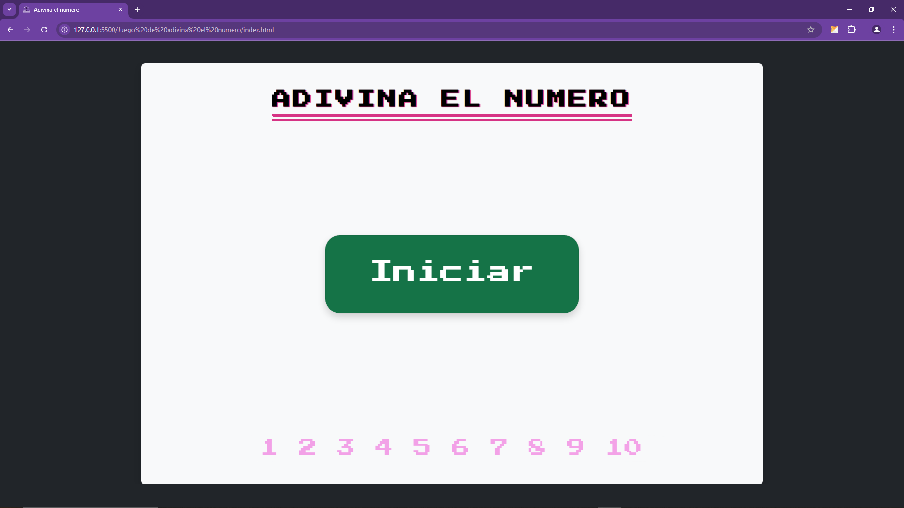
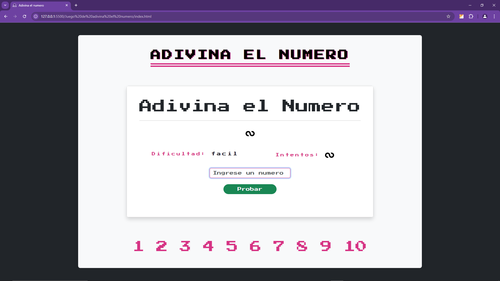
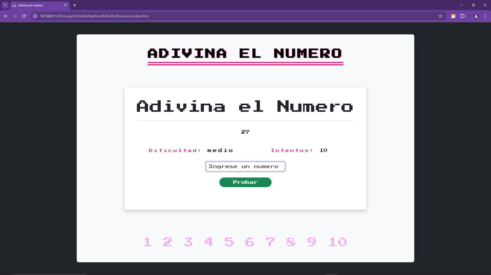

# Juego de adivinanza

Este proyecto está enfocado en crear un juego de adivina el numero entre 1 y 10. Un diseño en base a HTML, CSS, BootStrap y JS.

## Capturas de Pantalla

## Características

- Manejo de Transiciones
- Manejo de Animaciones
- Uso de Modals
- Validaciones

