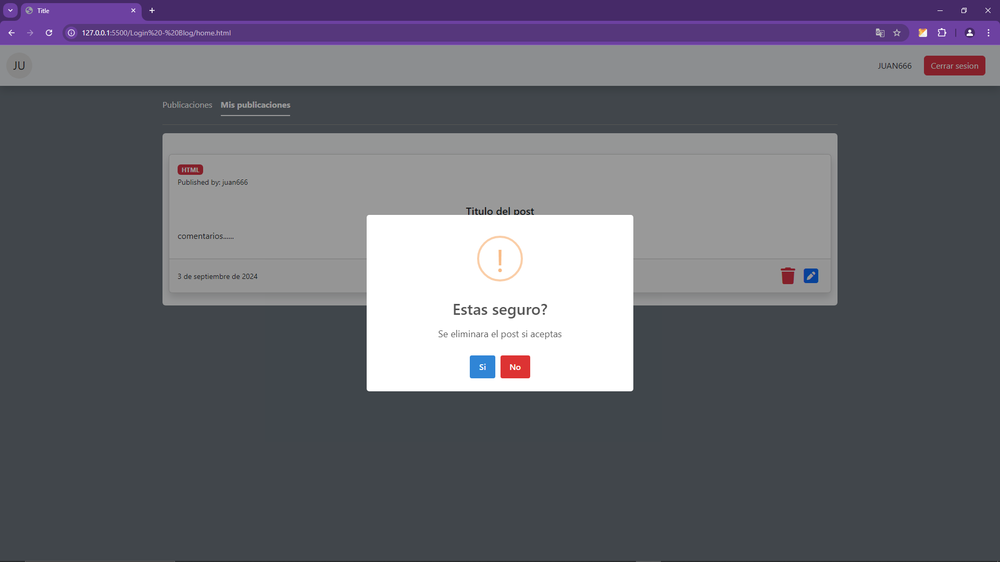

# Login JS-HTML-BOOTSTRAP

Un diseño de login/registro de usuarios con HTML, JS, CSS y Bootstrap. Este proyecto está enfocado en crear un formulario de autenticación con funcionalidades básicas de validación con boostrap, ademas de implementar un blog de comentarios, con las funcionalidades de crear, editar y eliminar.

## Capturas de Pantalla

## Características

- Diseño responsivo
- Efectos de hover
- Transiciones suaves
- Almacenamiento en localStorage para manejo de datos de usuario y CRUD de comentarios
- Validaciones con bootstrap
- Manejo de modals
- Uso de SweetAlert2 para manejo de alertas